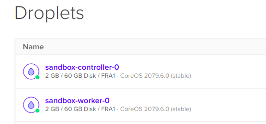
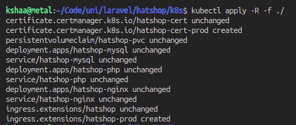
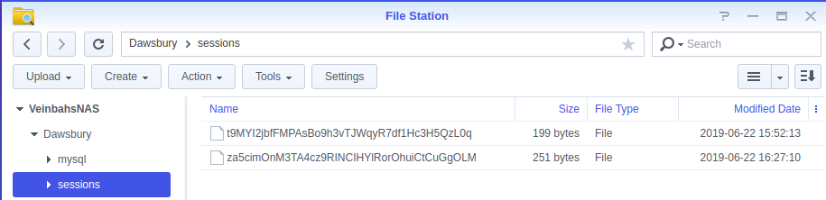

# Showcase of K8s deployment

First I deployed a Kubernetes cluster to DigitalOcean.  
It consisted of one master and one worker node.  
  

Then I deployed this projects' k8s manifests to the cluster.  
They consisted of Ingress (HTTP reverse proxy), SSL certificates, persistent NFS-based storage, MySQL, PHP & Nginx deployments & secrets/configuration files.  
  

Then after migration & seeding, the project was up and running & usable.  
  

Out of interest, I also checked that indeed session files are being created in the persistent storage after I logged in.  
I did this by logging into my NAS server & checking the NFS-capable volume contents.  
  

