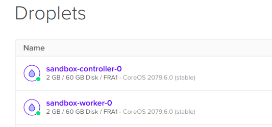
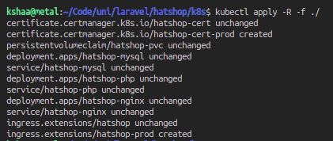
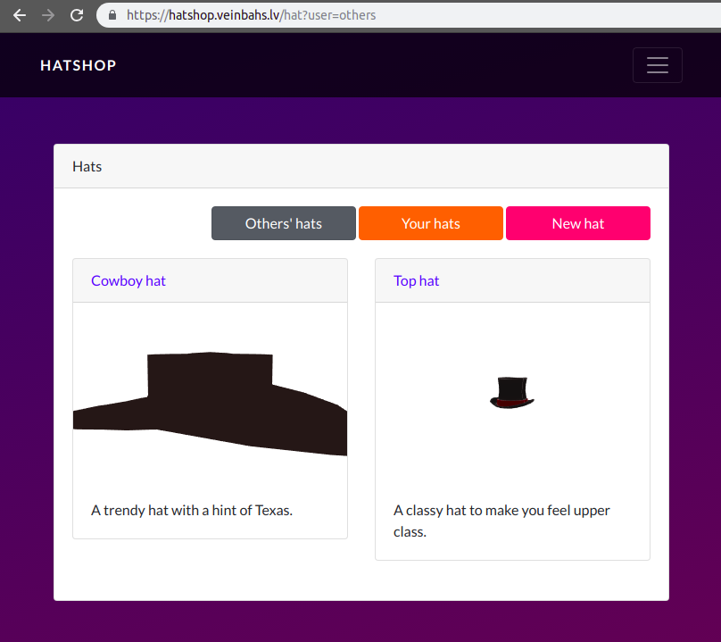
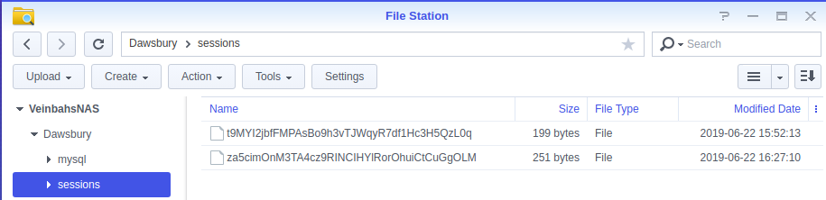

# Hatshop
A Laravel site to upload "Hats", "Charms" & trade them. 
Forked from [kshaa/laravel-sandbox](https://github.com/kshaa/laravel-sandbox), extended for deploying to Kubernetes.  

## Info
Includes user roles:
- Regular users "Traders" - can upload items, create trades & do purchases
- Special users "Trade managers" - who can approve new uploaded items
- Special users "Administrators" - who can delegate roles for all users

## Quickstart
```
# Run all containers
docker-compose up -d 

# Link hat model storage as public
docker-compose run php artisan storage:link

# Create database structure & seed it
docker-compose run php artisan migrate:fresh
docker-compose run php artisan db:seed
```

# Showcase of K8s deployment
First I deployed a Kubernetes cluster to DigitalOcean.  
It consisted of one master and one worker node.  
  

Then I deployed this projects' k8s manifests to the cluster.  
They consisted of Ingress (HTTP reverse proxy), SSL certificates, persistent NFS-based storage, MySQL, PHP & Nginx deployments & secrets/configuration files.  
  

Then after migration & seeding, the project was up and running & usable.  
  

Out of interest, I also checked that indeed session files are being created in the persistent storage after I logged in.  
I did this by logging into my NAS server & checking the NFS-capable volume contents.  
  

